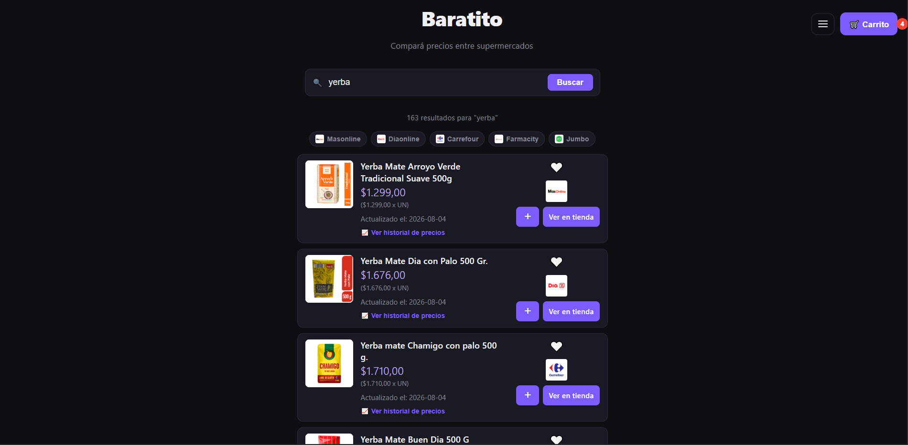
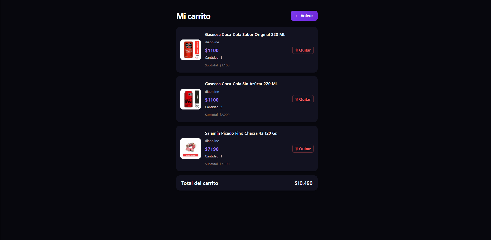
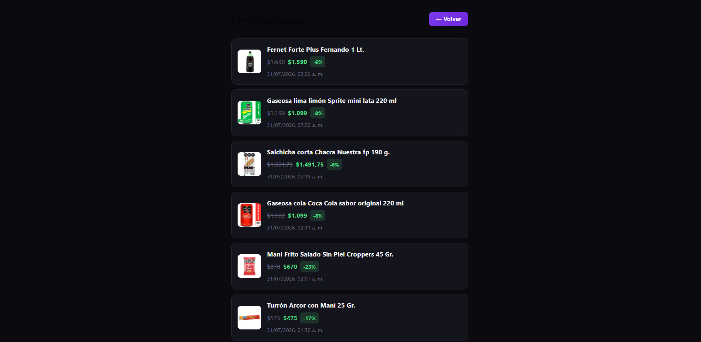
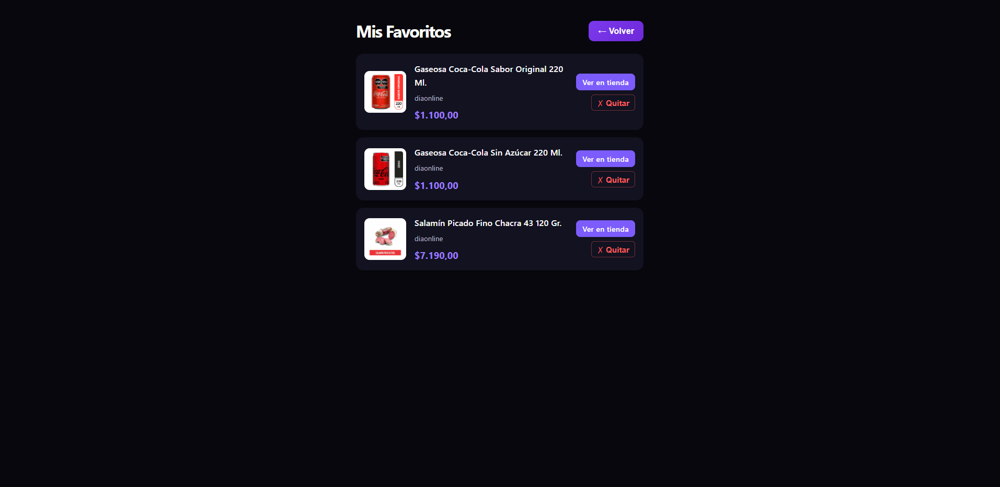
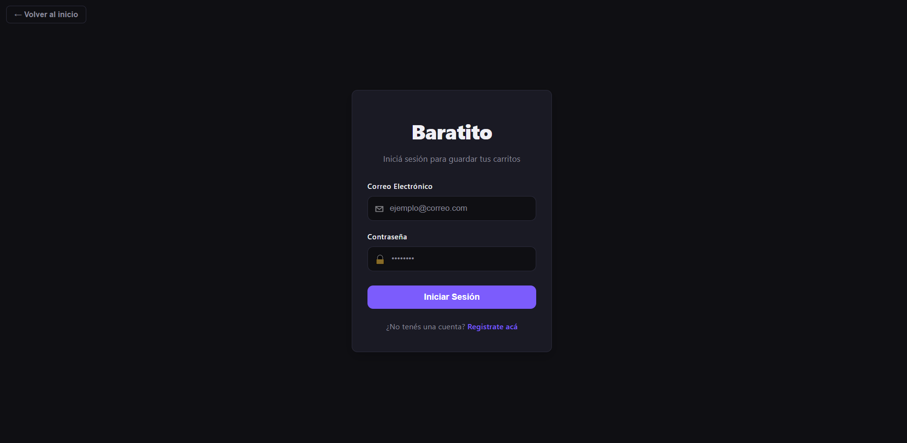
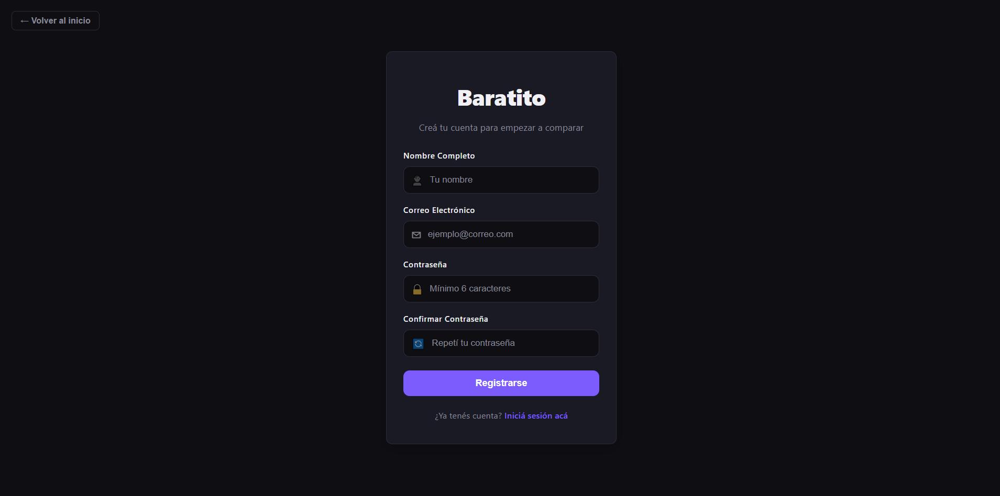
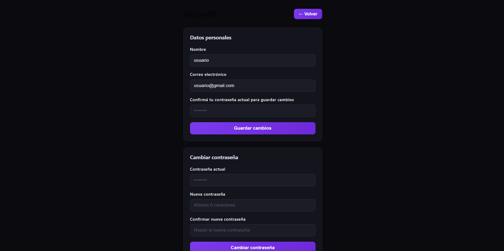

# 🛒 Baratito

🔗 **[Ver demo en vivo](https://baratito-sage.vercel.app/)**

**Baratito** es una plataforma web diseñada para centralizar y comparar los precios de productos en diferentes supermercados. El objetivo principal es ahorrarle tiempo y dinero a los usuarios, evitando que tengan que navegar por múltiples páginas web o recorrer tiendas físicas para encontrar las mejores ofertas.

---

## 📸 Capturas


*Comparación de precios entre supermercados para un mismo producto*


*Carrito con el total estimado de la compra*


*Alertas automáticas cuando baja el precio de un producto favorito*


*Productos favoritos marcados por el usuario*


*Login para el acceso de los usuarios*


*Registro para el acceso a usuarios nuevos*


*Perfil del usuario para cambiar sus datos*
---

## 🌐 Demo en producción

👉 **https://baratito-sage.vercel.app/**

**Usuario de prueba:**
- Email: `usuario@gmail.com`
- Contraseña: `123456`

> ⚠️ El backend corre en el plan gratuito de Render. Si nadie usó la app en los últimos 15 minutos, el servidor se "duerme" y el primer request puede tardar hasta un minuto en responder mientras vuelve a levantar. Es esperable, no está roto — solo hay que darle un momento.
Además para obtener la información de los productos, se realiza scraping lo cual a diferencia de tener APIs oficiales, hace que el proceso de buscar sea más lento. Por eso se integro una cache para que no se tenga que realizar scraping cada vez que se busca un producto. Si es la primera vez que se busca un producto, se realizará scraping. Si ya se buscó el producto anteriormente, se utilizará la cache haciendo mas rápida la carga de datos.
---

## 🚀 Características Principales

- **Autenticación de usuarios:** registro e inicio de sesión con JWT.
- **Búsqueda avanzada:** buscador con autocompletado y precios actualizados de distintos supermercados en tiempo real vía scraping.
- **Carrito comparador:** permite armar una lista de productos y ver el total estimado, sin necesidad de crear una cuenta — funciona también en modo anónimo.
- **Favoritos:** marcá productos para seguir de cerca su precio.
- **Notificaciones automáticas:** el sistema detecta bajadas de precio en productos favoritos y genera una alerta para el usuario.
- **Historial de precios:** seguimiento de la evolución del precio de un producto a lo largo del tiempo.
- **Perfil de usuario:** edición de datos personales y cambio de contraseña, con confirmación de identidad.

---

## 🧠 Decisiones técnicas

Algunas decisiones de diseño que tomé durante el desarrollo:

- **Autenticación stateless con JWT**, sin sesiones de servidor — el token viaja en el header `Authorization` y el `userId` se extrae del token validado en cada request, nunca se confía en datos que mande el cliente.
- **DTOs en vez de exponer entidades JPA directamente** — evita filtrar datos sensibles (como el hash de contraseña) y previene errores de serialización por relaciones circulares (`@ManyToMany` bidireccional entre `Usuario` y `ProductoSchema`).
- **Carrito con modo anónimo:** los usuarios sin cuenta pueden armar su lista de compras igual (en memoria, del lado del cliente), ya que la app está pensada como herramienta de comparación, no de e-commerce transaccional — no tiene sentido forzar un registro solo para sumar precios.
- **Sistema de notificaciones basado en comparación de precios:** al reprocesar resultados de un scrape, se compara el precio nuevo contra el guardado previamente; si bajó y el producto está en la lista de favoritos de algún usuario, se genera una notificación para cada uno.
- **Manejo de errores centralizado** con `@RestControllerAdvice`, devolviendo siempre un formato de respuesta consistente en toda la API.

---

## 🛠️ Stack Tecnológico

El proyecto está dividido en una arquitectura desacoplada (Frontend y Backend):

### Frontend
- **Framework:** React + Vite
- **Estilos:** HTML5 y CSS3 nativo

### Backend
- **Lenguaje:** Java
- **Framework:** Spring Boot + Spring Security
- **Gestor de Dependencias:** Gradle
- **Base de Datos:** PostgreSQL

### Infraestructura
- **Contenerización:** Docker y Docker Compose (para un entorno de desarrollo rápido y consistente)

### Deploy
- **Frontend:** Vercel
- **Backend:** Render
- **Base de datos:** Render (PostgreSQL)

---

## ⚙️ Correr el proyecto en local

Con `docker compose up --build`, Docker lee los archivos `Dockerfile` dentro de las carpetas `frontend` y `backend` y levanta ambos servicios junto con la base de datos.

### Requisitos previos

- [Docker](https://www.docker.com/)
- [Docker Compose](https://docs.docker.com/compose/)
- [Git](https://git-scm.com/)

### Pasos

1. **Clonar el repositorio:**
```bash
   git clone https://github.com/Nicole-Soares/baratito.git
   cd baratito
```

2. **Levantar los contenedores:**
```bash
   docker compose up --build
```
> Agregá `-d` al final si preferís correrlo en segundo plano (detached mode).

3. **Acceder a la aplicación:**
    - Frontend: [http://localhost:5173](http://localhost:5173)
    - Backend: [http://localhost:8080](http://localhost:8080)

---
